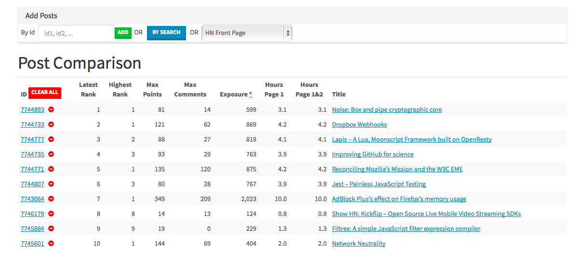
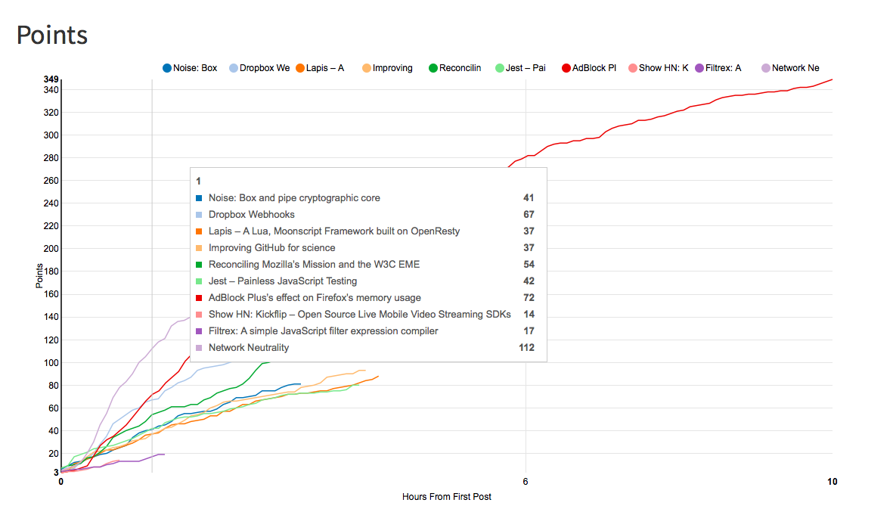
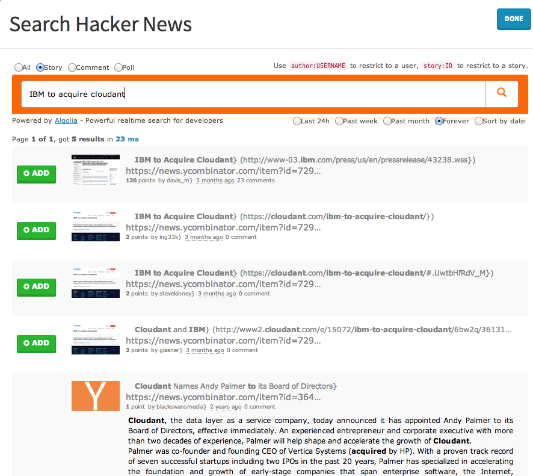
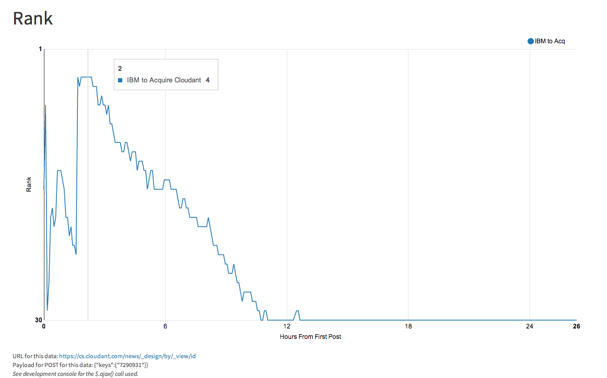

# hind-cite.com: Hacker News Data, Charts and Statistics

For better or worse, [Hacker News](http://news.ycombinator.com) remains the dominant forum for developer and startup discussions.  It's where the best satrtups launch, where we go to learn, and where we share.  We make announcements, post content, and cringe at every stinging comment.  Developers are kings, and hacker news is still the most likely place to find them.  At Cloudant, we build for the builders -- we provide application state as a service for developers creating fundamentally new things.  Therefore, what people post, when they post it, and how it is received by the community matters a great deal to our business.  And, while there are existing projects to provide APIs to catalog and search posts on HN, we feel that they are incomplete.  In particular, the dynamics of the system are, to our knowledge, yet un-studied.  How posts behave vs. time is a key metric that we approximate by statements like "we were on the front page for lunch today."  Wouldn't it be nice if you could actually track and analyze the time dependence of all posts?  Welcome to hind-cite.com, an MIT licensed application built by cloudant.com that provides time-dependent data, charts and statistics for HN posts.

# The Data 

We focus on providing time-dependent data by politely scraping the first two pages of HN.  We also scrape the "newest" page to augment initial data for posts.  To abide by HN guidance, we do not scrape deeper pages, although we believe we are sampling the most interesting portion of the data.  At specific intervals we snapshot the page and store the rank, number of comments, and number of points as JSON documents in a world readable [cloudant database](https://cs.cloudant.com/news).  The result is that we can track not just the final number of points and comments for a post, but the trajectory of how those metrics, plus the rank, evolved over time.  We believe this enables a wide variety of interesting studies.  For example, impact: the integral of `rank*dt`, evaluated for rank>30 (front page) or rank>60 (second page), is the most basic quantitative emeasure of your exposure in units of [rank][minutes].  We imagine this is of great interest for launch events, marketing, etc.  

# The Questions

In our spare time, we're researching this dataset in detail.  Here are some questions that we're looking into.  

1. Are the trajectories for all popular posts of the same shape?  
2. Are there identifiable clusters when you look in 4d space for rank vs points vs comments?
3. How does the impact of a post depend quantitatively on its respective cohort.  I.e., what's a good model to normalize performance based on what else was happening that day?
4. What fraction of posts have comment threads that are "hijacked" by the first comment? Is their a quantitative way to find this, perhaps by looking at (2) above?
5. What are more detailed metrics to collapse "performance" of a post onto a single number?
6. How does performance on HN compare to reddit, etc?
7. How is the HN community different than other communities, if at all?
8. Given the time-dependent data, can we create a good estimator for the number of active HN users per day?  Or can we at least create a relative ranking of the number of unique users between different days?

We're eager to work with the community and/or researches to flesh out these and other questions.

# Why Open Source?

We built hind-cite for several reasons:

1. We've routinely been unable to quantitatively address the impact of our posts within the larger developer community.
2. Many a debate has sprung up over lunch and coffee about voting rings, penalties, and general dynamics of the Hackernews community.  In initial off-hours research we discovered that the time info ration is a critical piece of information to allow us to analyze the data and test hypotheses about community (and moderator!) behavior.
3. We realized that this is a clean opportunity to show how one builds a modern Javascript application on Cloudant (see below).
4. We hope that this app may inspire community contributions to add additional data sources (Reddit, Lobste.rs, etc).
5. There's a ton of the interesting analysis to be done with these data, and we hope to include the best of those contributions into the app.

Therefore, the MIT license is a logical choice.  The application code is on github [here](https://github.com/cloudant-labs/hind-cite) (NOTE -- move this to cloudant-labs), and the scraper code can be found [here](https://github.com/cloudant-labs/hind-cite-scraper)

# The App

The primary value of hind-cite is the time-series data, and we've taken a first stab at analysis and visualization of the base quantities that we find most interesting to our use cases.  When you land at hind-cite, navigating to the [Post History](http://www.hind-cite.com/multiPost?list=top&limit=all) hero unit will take you to the action.  There, you'll see a dashboard that allows you to analyze the performance of one or more posts.  By default, we pull the top ten current posts.  First you'll find the dashboard sorted by current rank:

That table includes relevant statistics, including the previously mentioned 'exposure' ([rank]*[seconds]).  Hind-cite also provides an interactive d3 visualization of any selected posts:

We note that there are clearly different classes of trajectories if you project onto points, comments, or rank.  We are looking into those in more detail (see below).

Finally, when digging into a single post performance, you can either punch in the HN 'id' or search by content (thanks [Algiola](http://www.algolia.com/)):

(Note, we began capturing data reliably in February, 2014, so the search plug-in may return posts for which we have no recorded data.) Putting this all togheter, we can look at the total impact of the announcement of IBM's acquisition of Cloudant:

Thanks to davis_m, whomever you are, for posting.  You had Cloudant as high as #2, above the fold for 12 hours, and a full day before we fell off the 2nd page. 

# The API

Every post is encapsulated as a single document in Cloudant.  We reserve future posts for additional detail on the choice of data model, but simply note a few things:

* All data about a post (e.g. [`http://www.hind-cite.com/multiPost?postIds=7290931`](http://www.hind-cite.com/multiPost?postIds=7290931)) is pulled directly from cloudant ([`https://cs.cloudant.com/news/_design/by/_view/id?key="7290931"`](https://cs.cloudant.com/news/_design/by/_view/id?key=%227290931%22)).
* The application itself (discussed in more detail in the next post) is client-side Javascript and itself delivered directly to the browser from Cloudant [https://cs.cloudant.com/news/_design/by](https://cs.cloudant.com/news/_design/by).  We use the a cloudant VHOST to map ` `www.hind-cite.com` to `cs.cloudant.com/news/_design/by/_rewrite`

And, since the data comes directly from Cloudant, that means we get a built-in API for free.  If you're familiar with the Apache CouchDB API you already know how to query the hind-cite API.  If you have questions, then we have a few ways for you to get started easily:

* At the bottom of each page we list the cloudant query used to retrieve the data.  For example, the top-10 current posts come directly from [`https://cs.cloudant.com/news/_design/by/_view/latest?reduce=true&group=true&group_level=1&limit=10`](https://cs.cloudant.com/news/_design/by/_view/latest?reduce=true&group=true&group_level=1&limit=10).  
* Open the app in the inspector and take a look at the API response logged to the console.
* Dig into the cloudant API by heading over to the [docs](https://docs.cloudant.com)

# Thanks

As with all open source projects, we'd like to thank the following communities/authors for their code that we adapted or used: [edparcell](https://github.com/edparcell) for the python scrape, [angular.js](https://angularjs.org), [d3](http://d3js.org), [NVD3](http://nvd3.org), [Yeoman](http://yeoman.io), [Grunt](http://gruntjs.com), [Bootstrap](http://getbootstrap.com), [StackOverflow](http://StackOverflow.com)